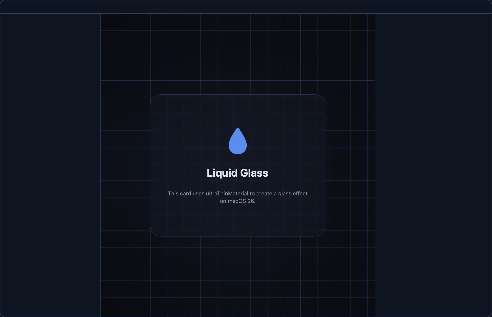
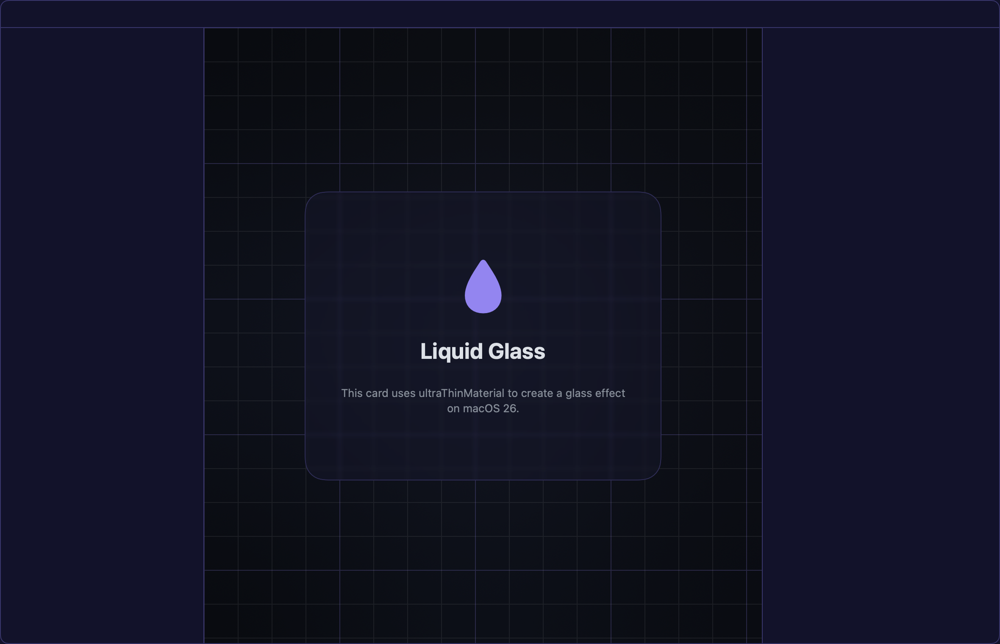
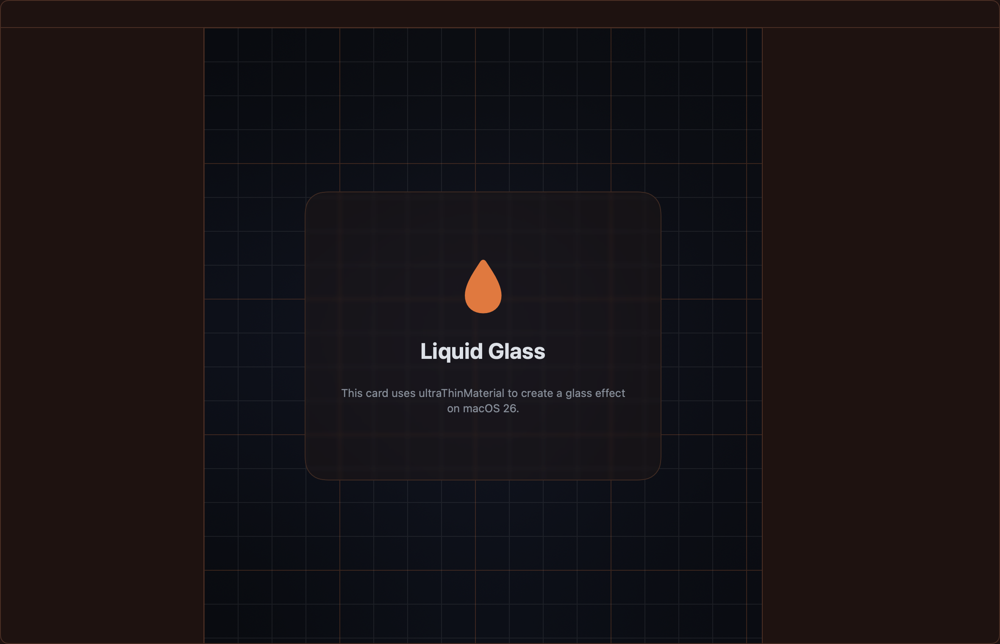
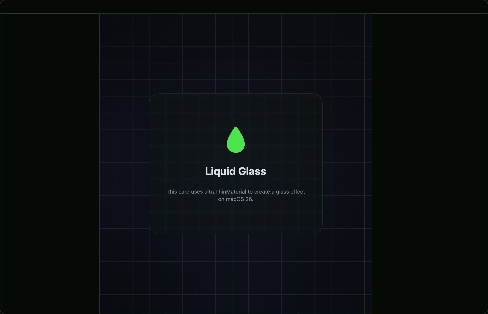
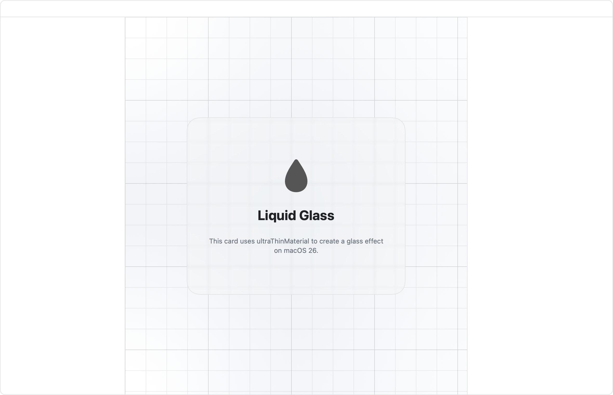

# LiquidGlassDemo

<p align="center">
  
</p>

A small macOS app that shows off a **Liquid Glass** hero card inside a themed,
three-column window shell. It's a focused, readable reference for building modern
macOS UI in pure SwiftUI — adaptive theming, live Light/Dark/System switching, a
native settings modal, and the AppKit bridges you reach for when SwiftUI stops
short. Built as a Swift Package, so there's no Xcode project to open.

## Features

- **Three-column shell** — a collapsible left sidebar, a main content area (the
  glass card over a grid backdrop), and an optional right panel. Toggles live on
  the traffic-light row as native titlebar accessories.
- **Six themes** — Slate, Nous, Midnight, Ember, Mono, and Cyberpunk, each with
  light and dark variants. Pick a theme and the whole app recolors instantly.
- **Light / Dark / System** — an explicit appearance mode that resolves System to
  the live OS setting and reverts cleanly.
- **Glass controls** — tune the card's opacity and the backdrop blur behind it from
  the settings panel and watch the frosted grid respond.
- **Native settings modal** — a dim backdrop, a sectioned panel, and a custom thin
  scrollbar, all themed.
- **Persistence** — theme, appearance mode, glass settings, and sidebar state are
  saved to `UserDefaults` and restored on the next launch.

## Themes

| | |
|---|---|
|  |  |
|  |  |
|  |  |

## Requirements

- **macOS 15+** — uses `pointerStyle`, `onScrollGeometryChange`, and `ScrollPosition`.
- **Swift 6** (Xcode 16+). Check with `swift --version`.

## Build & run

```bash
swift run                 # launch the app window
swift build -c release    # release build
```

To quit, use ⌘Q — closing the window keeps the app running (standard macOS behavior).

## Testing & verifying

```bash
swift test                # swift-testing suites (hover, mesh, opacity, theme, wiring)
./verify.sh               # build → test → render a PNG snapshot → report
./verify.sh --no-visual   # build + test only
```

`verify.sh` renders a snapshot in-process with `ImageRenderer` — no window and no
Screen Recording permission — which makes it a deterministic visual check for CI.
Render one directly, and pick a theme and appearance:

```bash
BIN="$(swift build --show-bin-path)/LiquidGlassDemo"
"$BIN" --snapshot out.png --size 1180x760 --appearance dark --theme cyberpunk
```

> **Snapshot caveats:** `ImageRenderer` can't capture live AppKit controls, the
> real material blur, `NSWindow` transparency, or the settings modal — those only
> appear in the running app. The `--appearance`/`--theme` flags drive the palette so
> snapshots still vary by theme and light/dark.

## Project structure

| Path | Purpose |
|------|---------|
| [LiquidGlassDemoApp.swift](Sources/LiquidGlassDemo/LiquidGlassDemoApp.swift) | `@main` entry; windowed app, `--snapshot`/`--icon` render modes, `AppDelegate` (Dock icon, activation, window lifecycle) |
| [ContentView.swift](Sources/LiquidGlassDemo/ContentView.swift) | Three-column shell, header, and window configuration |
| [Sidebars.swift](Sources/LiquidGlassDemo/Sidebars.swift) | `SidebarTint` — the translucent side columns |
| [SettingsModal.swift](Sources/LiquidGlassDemo/SettingsModal.swift) · [ThemePicker.swift](Sources/LiquidGlassDemo/ThemePicker.swift) | Settings modal and the Appearance/theme UI |
| [HeaderAccessory.swift](Sources/LiquidGlassDemo/HeaderAccessory.swift) · [IconButton.swift](Sources/LiquidGlassDemo/IconButton.swift) | Titlebar accessory buttons |
| [Theme.swift](Sources/LiquidGlassDemo/Theme.swift) | `ThemeStore` (`@Observable`) and every palette |
| [DesignSystem.swift](Sources/LiquidGlassDemo/DesignSystem.swift) | `Radius`, `Layout`, `Typography`, `Prefs` tokens + `themedBorder` |
| [TransparencyModel.swift](Sources/LiquidGlassDemo/TransparencyModel.swift) · [UIState.swift](Sources/LiquidGlassDemo/UIState.swift) | `@Observable`, persisted state |
| [LiquidGlassModel.swift](Sources/LiquidGlassDemo/LiquidGlassModel.swift) | Testable value types — card content, hover, `OpacityControl`, mesh backdrop |
| [WindowConfigurator.swift](Sources/LiquidGlassDemo/WindowConfigurator.swift) · [PatternBackground.swift](Sources/LiquidGlassDemo/PatternBackground.swift) · [ScrollableContent.swift](Sources/LiquidGlassDemo/ScrollableContent.swift) · [AppIcon.swift](Sources/LiquidGlassDemo/AppIcon.swift) | `NSWindow` bridge, grid, custom scrollbar, Dock icon |
| [Tests/](Tests/LiquidGlassDemoTests/) | swift-testing suites, one per subject |

**State & reactivity.** `ThemeStore`, `UIState`, and `TransparencyModel` are
`@Observable` classes owned by `ContentView` and injected through the environment,
so any view that reads them re-renders when they change — switching a theme recolors
the app with no manual refresh. Values persist via `UserDefaults` (keys in `Prefs`).
SwiftUI can't set window-level transparency or appearance directly, so
[WindowConfigurator](Sources/LiquidGlassDemo/WindowConfigurator.swift) bridges to the
`NSWindow`.

## License

MIT — see [LICENSE](LICENSE).
