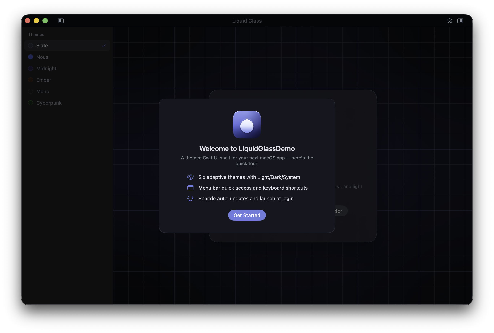
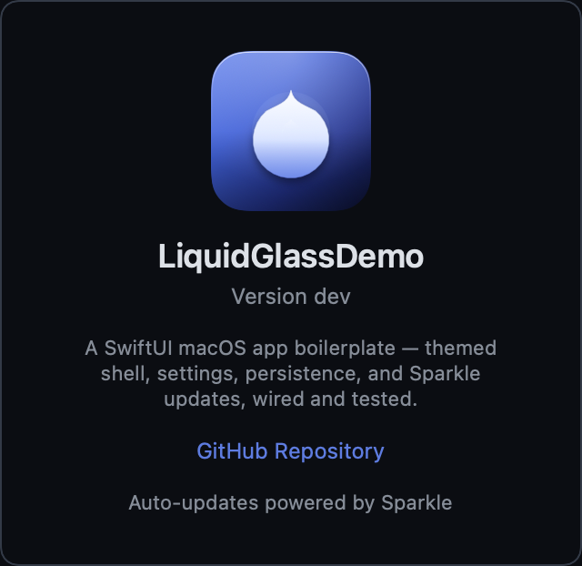

# LiquidGlassDemo

<p align="center">
  
</p>

A **boilerplate macOS app template** built in pure SwiftUI — clone it (or hit
**Use this template** above) as the starting point for your own desktop app. It
ships a themed **Liquid Glass** window shell — native `glassEffect` on macOS 26
with a tuned fallback on earlier versions — already wired to the pieces every
real app needs: adaptive multi-theme support, live Light/Dark/System switching,
a native settings modal, persisted preferences, Sparkle auto-updates, and the
AppKit bridges you reach for when SwiftUI stops short. Built as a Swift 6
package (SwiftPM), so there's no Xcode project to open — `swift run` and go.

## Features

- **Three-column shell** — a collapsible left sidebar with a theme quick-switch
  list, a main content area (the glass card over a themed mesh backdrop), and an
  optional right inspector panel. Toggles live on the traffic-light row as native
  titlebar accessories.
- **Real Liquid Glass** — the hero card uses the native `glassEffect` on macOS 26
  (clear, interactive — tint and frost painted beneath it, so the sliders always
  respond), with a tuned blur-mask fallback below it.
- **Menu bar extra** — a system tray menu (`MenuBarExtra`) with open/focus, quick
  theme switching, update check, and quit. The theme store is shared with the
  window, so a tray switch recolors it live. One window max (a single `Window`
  scene, no New Window duplicates).
- **Six themes** — Slate, Nous, Midnight, Ember, Mono, and Cyberpunk, each with
  light and dark variants. Pick a theme and the whole app recolors instantly —
  including the mesh backdrop behind the card.
- **Light / Dark / System** — an explicit appearance mode that resolves System to
  the live OS setting and reverts cleanly.
- **Glass controls** — tune the card's opacity and the backdrop blur behind it from
  the settings panel and watch the frosted grid respond.
- **Native settings modal** — a dim backdrop and a themed, sectioned panel
  (General / Appearance / Accessibility) with a custom thin scrollbar.
- **Persistence** — theme, appearance mode, glass settings, and sidebar state are
  saved to `UserDefaults` and restored on the next launch.
- **Menu commands & shortcuts** — a real menu bar: a themed About panel, ⌘, for
  settings, ⌃⌘S / ⌥⌘I sidebar and inspector toggles, and a Themes menu with
  ⌘1–⌘6 quick switching. Window-owned state reaches the menus via `@FocusedValue`.
- **Launch at Login** — an `SMAppService`-backed toggle in settings, disabled
  under `swift run` (same guard philosophy as Sparkle).
- **Diagnostics** — Help ▸ Copy Debug Info puts app/macOS versions, theme, and
  glass settings on the clipboard. Logging goes through `os.Logger` categories
  in `AppLog.swift` (filter in Console.app by subsystem).
- **Accessibility-ready** — Reduce Motion and Reduce Transparency are honored by
  the glass rendering, Increase Contrast strengthens borders, and the custom
  controls carry VoiceOver labels and hints. An **Accessibility** section in
  settings layers in-app toggles on top of the system settings.
- **Deep links** — `liquidglassdemo://theme/ember` switches themes from anywhere
  (packaged app only). The URL parser is pure and unit-tested.
- **Localization scaffold** — English, German, French, Spanish, and Portuguese
  `.strings` tables wired through `L10n`, so apps built on the template start
  localized.
- **Debug menu (debug builds)** — reset all preferences or force Light/Dark/System
  from the menu bar; compiled out of release builds.
- **First-run onboarding** — a localized welcome panel shown once; completion
  persists. Debug ▸ Reset Onboarding brings it back (debug builds).

## Themes

Every theme ships with a light and a dark variant.

<table>
  <tr><th>Dark</th><th>Light</th></tr>
  <tr>
    <td colspan="2"><b>Slate</b></td>
  </tr>
  <tr>
    <td></td>
    <td></td>
  </tr>
  <tr>
    <td colspan="2"><b>Nous</b></td>
  </tr>
  <tr>
    <td></td>
    <td></td>
  </tr>
  <tr>
    <td colspan="2"><b>Midnight</b></td>
  </tr>
  <tr>
    <td></td>
    <td></td>
  </tr>
  <tr>
    <td colspan="2"><b>Ember</b></td>
  </tr>
  <tr>
    <td></td>
    <td></td>
  </tr>
  <tr>
    <td colspan="2"><b>Mono</b></td>
  </tr>
  <tr>
    <td></td>
    <td></td>
  </tr>
  <tr>
    <td colspan="2"><b>Cyberpunk</b></td>
  </tr>
  <tr>
    <td></td>
    <td></td>
  </tr>
</table>

## Settings

Open settings from the titlebar cog or with ⌘,. It's a native, fully themed modal — a dim
backdrop, a sectioned sidebar nav (General / Appearance / Accessibility), and a custom thin
scrollbar — not a stock `Settings` scene, so it recolors with the rest of the app and is easy
to extend: add a section to `SettingsSection` or a row to a page in `SettingsModal.swift`.

The **Appearance** section drives the whole look:

- **Light / Dark / System** — a segmented mode control layered on top of the theme.
- **Theme picker** — a searchable grid where every theme is a live mini-mockup
  card; the selected one carries an accent border.
- **Card Opacity** and **Card Blur** — sliders that tune the glass card and its
  frosted backdrop in real time.
- **Accessibility** — in-app Reduce Motion / Reduce Transparency / Increase
  Contrast toggles, layered on top of the system settings.

Every choice persists to `UserDefaults` and is restored on the next launch. The
modal also hosts **Launch at Login** (`SMAppService`), enabled only in the
packaged app.

| Dark | Light |
|---|---|
|  |  |

## First run & About

A localized welcome panel shows once on first launch (bring it back with
Debug ▸ Reset Onboarding in debug builds). The About panel is themed too —
icon, version, links — replacing the stock AppKit panel.

| Onboarding | About |
|---|---|
|  |  |

## Install

Download the latest **`LiquidGlassDemo.dmg`** from the
[Releases](https://github.com/SohrabZ/swiftui-macos-app/releases) page, open it, and
drag the app to Applications. It's signed, notarized, and updates itself via
[Sparkle](https://sparkle-project.org) — new versions arrive automatically, or check
manually from **LiquidGlassDemo ▸ Check for Updates…**. Maintainers: see
[RELEASE.md](RELEASE.md) for cutting a release.

## Requirements

- **macOS 15+** — uses `pointerStyle`, `onScrollGeometryChange`, and `ScrollPosition`;
  on macOS 26 the hero card upgrades to the real `glassEffect` (gated with
  `#available`, blur-mask fallback below).
- **Swift 6** (Xcode 16+). Check with `swift --version`.

## Build & run

```bash
swift run                 # launch the app window
swift build -c release    # release build
```

To quit, use ⌘Q — closing the window keeps the app running (standard macOS behavior).

## Testing & verifying

```bash
swift test                     # swift-testing suites (hover, mesh, opacity, theme, wiring)
scripts/verify.sh              # build → test → render a PNG snapshot → report
scripts/verify.sh --no-visual  # build + test only
```

`verify.sh` renders a snapshot in-process with `ImageRenderer` — no window and no
Screen Recording permission — which makes it a deterministic visual check for CI.
Render one directly, and pick a theme and appearance:

```bash
BIN="$(swift build --show-bin-path)/LiquidGlassDemo"
"$BIN" --snapshot out.png --size 1180x760 --appearance dark --theme cyberpunk
"$BIN" --snapshot about.png --view about  # the About panel at its natural size
```

> **Snapshot caveats:** `ImageRenderer` can't capture live AppKit controls, the
> real material blur, `NSWindow` transparency, or the settings modal — those only
> appear in the running app. The `--appearance`/`--theme` flags drive the palette so
> snapshots still vary by theme and light/dark.

## Project structure

| Path | Purpose |
|------|---------|
| [LiquidGlassDemoApp.swift](Sources/LiquidGlassDemo/LiquidGlassDemoApp.swift) | `@main` entry; single `Window` scene + `MenuBarExtra` tray, `--snapshot`/`--icon` render modes, `AppDelegate` (Dock icon, activation, window lifecycle) |
| [ContentView.swift](Sources/LiquidGlassDemo/ContentView.swift) | Three-column shell, header, and window configuration |
| [HeroCard.swift](Sources/LiquidGlassDemo/HeroCard.swift) | The glass hero card — native `glassEffect` on macOS 26, tinted fallback below |
| [Sidebars.swift](Sources/LiquidGlassDemo/Sidebars.swift) | Translucent side columns: theme quick-switch list, inspector, resize dividers |
| [SettingsModal.swift](Sources/LiquidGlassDemo/SettingsModal.swift) · [ThemePicker.swift](Sources/LiquidGlassDemo/ThemePicker.swift) | Settings modal and the Appearance/theme UI |
| [OnboardingView.swift](Sources/LiquidGlassDemo/OnboardingView.swift) | First-run welcome panel (shown once, persisted) |
| [HeaderAccessory.swift](Sources/LiquidGlassDemo/HeaderAccessory.swift) · [IconButton.swift](Sources/LiquidGlassDemo/IconButton.swift) | Titlebar accessory buttons |
| [Theme.swift](Sources/LiquidGlassDemo/Theme.swift) | `ThemeStore` (`@Observable`) and every palette |
| [ShellCommands.swift](Sources/LiquidGlassDemo/ShellCommands.swift) · [AboutView.swift](Sources/LiquidGlassDemo/AboutView.swift) | Menu-bar commands (About, ⌘, settings, ⌃⌘S / ⌥⌘I toggles, Themes ⌘1–6, Copy Debug Info) and the `@FocusedValue` keys; the themed About panel |
| [AppLog.swift](Sources/LiquidGlassDemo/AppLog.swift) · [AppInfo.swift](Sources/LiquidGlassDemo/AppInfo.swift) · [Diagnostics.swift](Sources/LiquidGlassDemo/Diagnostics.swift) | OSLog categories; bundle name/version metadata; the Help ▸ Copy Debug Info report |
| [LaunchAtLogin.swift](Sources/LiquidGlassDemo/LaunchAtLogin.swift) | `SMAppService` login-item state (no-op outside a packaged `.app`) |
| [DesignSystem.swift](Sources/LiquidGlassDemo/DesignSystem.swift) | `Radius`, `Layout`, `Typography`, `Prefs` tokens + `themedBorder` |
| [TransparencyModel.swift](Sources/LiquidGlassDemo/TransparencyModel.swift) · [UIState.swift](Sources/LiquidGlassDemo/UIState.swift) · [AccessibilitySettings.swift](Sources/LiquidGlassDemo/AccessibilitySettings.swift) | `@Observable`, persisted state |
| [LiquidGlassModel.swift](Sources/LiquidGlassDemo/LiquidGlassModel.swift) | Testable value types — card content, hover, `OpacityControl`, mesh backdrop, `GlassA11y` |
| [ErrorStore.swift](Sources/LiquidGlassDemo/ErrorStore.swift) · [DeepLink.swift](Sources/LiquidGlassDemo/DeepLink.swift) | The app-wide error alert; deep-link parsing (`liquidglassdemo://theme/<id>`) |
| [L10n.swift](Sources/LiquidGlassDemo/L10n.swift) · [Resources/](Sources/LiquidGlassDemo/Resources/) | Localized strings via `Bundle.module` (en/de/fr/es/pt `.strings`) |
| [WindowConfigurator.swift](Sources/LiquidGlassDemo/WindowConfigurator.swift) · [PatternBackground.swift](Sources/LiquidGlassDemo/PatternBackground.swift) · [ScrollableContent.swift](Sources/LiquidGlassDemo/ScrollableContent.swift) · [AppIcon.swift](Sources/LiquidGlassDemo/AppIcon.swift) | `NSWindow` bridge, grid, custom scrollbar, Dock icon |
| [Tests/](Tests/LiquidGlassDemoTests/) | swift-testing suites, one per subject |

**State & reactivity.** `ThemeStore`, `UIState`, and `TransparencyModel` are
`@Observable` classes owned by `ContentView` and injected through the environment,
so any view that reads them re-renders when they change — switching a theme recolors
the app with no manual refresh. Values persist via `UserDefaults` (keys in `Prefs`).
SwiftUI can't set window-level transparency or appearance directly, so
[WindowConfigurator](Sources/LiquidGlassDemo/WindowConfigurator.swift) bridges to the
`NSWindow`.

## Make it your own

Starting a new app from this template:

- **Rename** the executable and package in [Package.swift](Package.swift), then
  update the product name in `app.yml` / the release scripts, the log subsystem
  in `AppLog.swift`, the fallback name/repo URL in `AppInfo.swift`, and the URL
  scheme in `app.yml` + `DeepLink.swift`.
- **Retheme** by editing the two palette tables (`ThemeStore.palettes` and
  `ThemeSwatch.all`) — keep them in sync; they share `ThemeID`.
- **Retoken** sizes, radii, fonts, and defaults keys in
  [DesignSystem.swift](Sources/LiquidGlassDemo/DesignSystem.swift) instead of
  inlining values.
- **Extend settings** by adding a row to a page in
  [SettingsModal.swift](Sources/LiquidGlassDemo/SettingsModal.swift), or a whole
  section to `SettingsSection`.
- **Swap the content** — replace the demo glass card in
  [HeroCard.swift](Sources/LiquidGlassDemo/HeroCard.swift) with your own
  main view; the shell, theming, and settings stay.
- **Rewrite the welcome** — put your own pages in
  [OnboardingView.swift](Sources/LiquidGlassDemo/OnboardingView.swift); the
  show-once routing (`UIState.completeOnboarding()`) stays.

## License

MIT — see [LICENSE](LICENSE).
